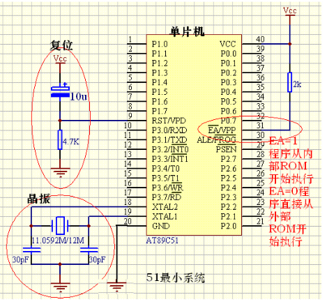

首先需要电脑一台，单片机开发板一块(51系列即可)。  
当然有必要说明的是，虽然51系列已经是很老旧的版本了，但是仍然使用它，因为它曾经辉煌过。这不是重点，重点在于网上各种
文档相对而言是很多的。而且学习单片机，我们学习一个系列就可以了，然后当我们再去学习其他系列的时候，我们完全可以触类旁通，可以很快速的上手任何一个版本的单片机。  
这个过程其实是和你学习编程是一样的，你学习了某一们语言后，当你再去学习其他语言的时候，你会发现你已经会利用先前学过的知识以及经验来学习这一个新的编程语言了。
### 环境搭建
工欲善其事必先利其器。首先在你的电脑上安装好一个环境是必须的。  
安装`Keil`
我在Windows10环境下安装。
win7应该是安装keil最好的环境了，win10在使用过程中也许会出现一些奇怪的问题，但是一般不会出现什么大问题。我们没必要为了安装一个软件而更换系统。

### 51单片机最小系统
单片机最小系统,或者称为最小应用系统,是指用最少的元件组成的单片机可以工作的系统. 对51系列单片机来说,最小系统一般应该包括:单片机、电源、晶振电路、复位电路。
1. 单片机

89C51单片机一片

2. 电源

5V直流电源1个

3. 晶振电路

包括12MHz晶振1只、30pF瓷片电容2只

4. 复位电路

10uF电解电容1只，4k7电阻1只

  
>注：上图中/EA（31引脚）也可直接连接电源VCC，2k电阻可去除。

#### 51单片机最小系统

1、时钟电路51 单片机上的时钟管脚：　　XTAL1（19 脚） ：芯片内部振荡电路输入端。　　XTAL2（18 脚） ：芯片内部振荡电路输出端。

2、复位电路　　在单片机系统中，复位电路是非常关键的，当程序跑飞（运行不正常）或死机（停止运行）时，就需要进行复位。　　MCS-5l 系列单片机的复位引脚RST（ 第9 管脚） 出现2个机器周期以上的高电平时，单片机就执行复位操作。如果RST 持续为高电平，单片机就处于循环复位状态。

3、EA/VPP（31 脚） 的功能和接法　　51 单片机的EA/VPP（31 脚） 是内部和外部程序存储器的选择管脚。当EA 保持高电平时，单片机访问内部程序存储器；当EA 保持低电平时，则不管是否有内部程序存储器，只访问外部存储器。
